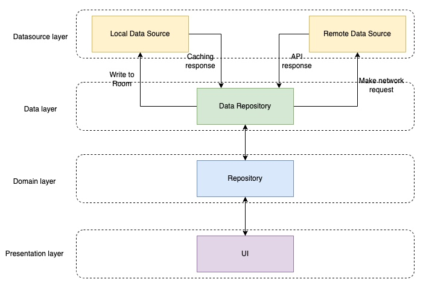
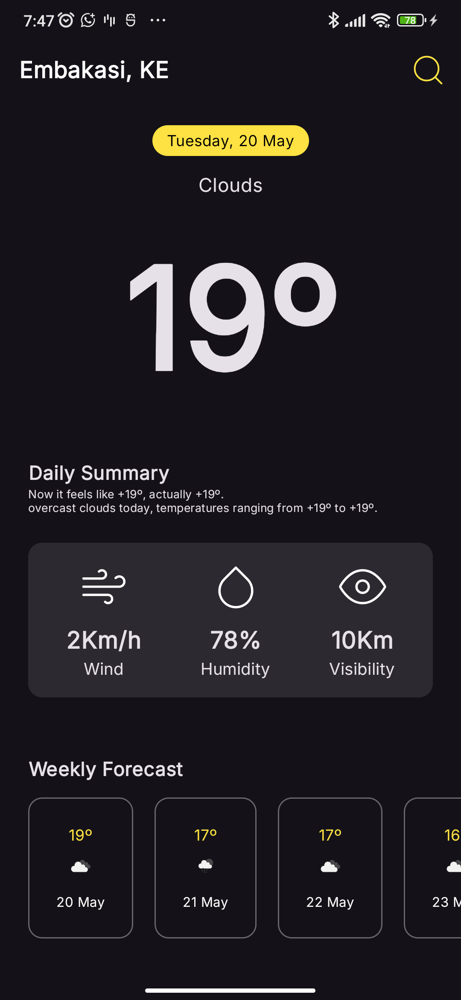
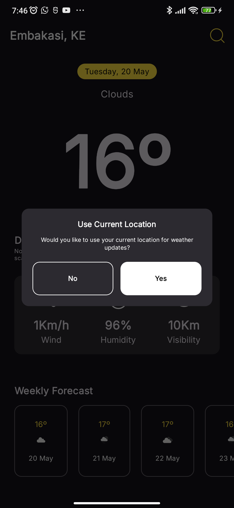
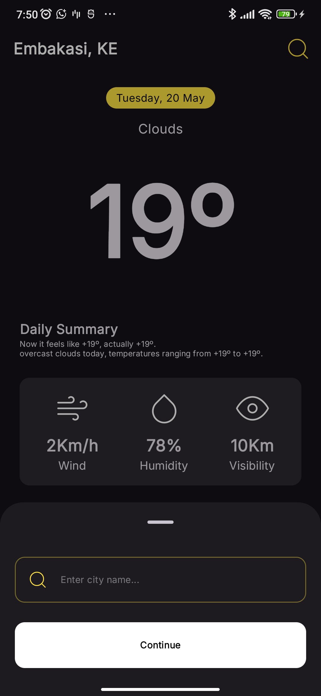
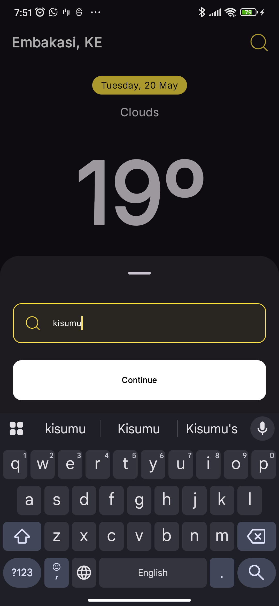

# WeatherApp

**WeatherApp** is a modern Android weather application built with **Jetpack Compose** and a **Clean Architecture** foundation. It features an offline-first approach, scalable modular design, and adheres to best software engineering principles like SOLID and separation of concerns. The project leverages Gradle convention plugins and CI/CD for consistent quality checks and builds.

[](https://github.com/ericwafula/WeatherApp/actions)  
[](LICENSE.txt)

---

## Table of Contents

- [Tech Stack](#tech-stack)
- [Features](#features)
- [Architecture & Modularization](#architecture--modularization)
- [Offline-First Approach](#offline-first-approach)
- [Code Quality](#code-quality)
- [Getting Started](#getting-started)
- [License](#license)

---

## Tech Stack

- **Kotlin** — Primary language
- **Jetpack Compose** — UI toolkit
- **Room** — Local data persistence
- **Ktor Client** — Networking layer
- **Koin** — Dependency Injection
- **Coroutines & Flow** — Asynchronous and reactive programming
- **Material 3** — UI Components
- **Location Services** — Geolocation support
- **Timber** — Structured logging
- **Firebase Analytics & Crashlytics** — Monitoring and crash reporting

---

## Features

- Fetch and display weather data by city or geolocation
- Offline-first support using Room
- Integrated location permission handling
- Built with scalable, maintainable architecture
- Material 3 theming & custom design system
- Secure token & config management
- Gradle build-logic with convention plugins

---

## Architecture & Modularization



The project is based on **Clean Architecture** principles and modularized into the following layers:

### Modules

- `:app` — App-specific implementation (UI, DI, ViewModels, screens)
- `:core:domain` — interfaces, and models
- `:core:ui` — Shared UI elements and utilities
- `:core:designsystem` — Custom theme, typography, spacing, and components

---

## Offline-First Approach

The app prioritizes cached data. When a user opens the app:

1. Local Room DB is queried for the latest weather data
2. A background fetch from the API updates the cache
3. UI displays cached data instantly, improving UX on poor networks

This model ensures better responsiveness and offline support.

---

## Code Quality

-  **SOLID Principles** enforced throughout architecture
-  **Gradle Convention Plugins** for consistent module configuration
-  **CI/CD Pipeline** for lint checks & build verification (pull requests → `dev` branch)
-  **Ktlint** for Kotlin code style enforcement

---

## Screenshots

<div style="display: flex; gap: 10px;">
  
  
  
  
</div>

---

## Getting Started

### Prerequisites

- Android Studio Hedgehog or newer
- `local.properties` or `.env` setup with:
    - `OPEN_WEATHER_BASE_URL`, you can use this: http://api.openweathermap.org/data/2.5/
    - `OPEN_WEATHER_API_KEY`
    - `CITY_API`
- Note: The city API is currently not in use yet but you can add some dummy api key

### Installation

```bash
git clone https://github.com/ericwafula/WeatherApp.git
cd WeatherApp
```

---

## License
This project is licensed under the [MIT License](LICENSE.txt).